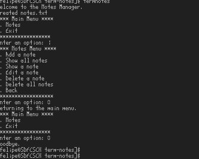

# Term Notes

"TermNotes" is a command-line note management utility designed to help you organize your ideas and reminders efficiently. It allows you to create, display, update, and delete notes directly from the terminal, providing you with a fast and straightforward workflow. With "TermNotes," you can keep track of your thoughts and important tasks, all within your favorite command-line environment. Simplify your life and enhance your productivity with this minimalist yet powerful tool.

## Installation
### Via AUR using YAY

https://aur.archlinux.org/packages/term-notes

Term Notes is available on AUR (Arch User Repository), and it can be installed using the `yay` package manager. Follow the steps below to install Term Notes:

1. Make sure you have `yay` installed. If not, you can install it with the following command:

   sudo pacman -S yay

   Once yay is installed, you can install Term Notes by running the following command:
   yay -S term-notes

This command will automatically fetch the package from AUR and handle the installation process for you.

### Via Brew

## Installation

You can easily install Term Notes using Homebrew. If you don't have Homebrew installed, you can get it from [brew.sh](https://brew.sh).

To install Term Notes, run the following command:

brew install term-notes

### Usage after installing with Brew

After installing Term Notes, you can launch it from the command line by running:
term-notes or just term_notes

### Prerequisites

- GCC (GNU Compiler Collection)
- Nano or Vim text editor

### Compiling the Source Code

1. Clone the repository:
git clone https://github.com/felipealfonsog/term-notes.git

2. Navigate to the project directory:
cd term-notes

3. Compile the source code:
gcc -o term_notes term_notes.c

## Usage

- To create a new note:
term_notes create

- To edit an existing note:
term_notes edit [note_id]

- To view all notes:
term_notes list

- To delete a note:
term_notes delete [note_id]

## Contributing

Contributions are welcome! Here's how you can contribute to Term Notes:

1. Fork the repository.
2. Create a new branch: `git checkout -b feature/your-feature-name`.
3. Make your changes and commit them: `git commit -m 'Add your feature'`.
4. Push the changes to your branch: `git push origin feature/your-feature-name`.
5. Create a new pull request.

## License

Term Notes is licensed under the MIT License. See [LICENSE](LICENSE) for more information.

## Contact

If you have any questions or suggestions, feel free to reach out to me:

- Email: f.alfonso@res-ear.ch
- LinkedIn: [felipealfonsog](https://www.linkedin.com/in/felipealfonsog/)
- GitHub: [felipealfonsog](https://github.com/felipealfonsog)

If you find this project helpful and would like to support its development, you can contribute via PayPal:

[Support via PayPal](https://www.paypal.me/felipealfonsog)
