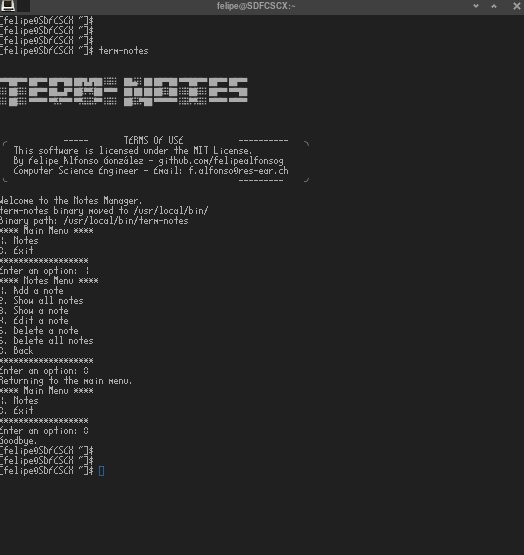

### Term Notes 📋📌

"TermNotes"* is a command-line note management utility designed to help you organize your ideas and reminders efficiently. It allows you to create, display, update, and delete notes directly from the terminal, providing you with a fast and straightforward workflow. With "TermNotes," you can keep track of your thoughts and important tasks, all within your favorite command-line environment. Simplify your life and enhance your productivity with this minimalist yet powerful tool.


[](https://github.com/Naereen/badges/)

[](https://lbesson.mit-license.org/)
<!--
[](http://perso.crans.org/besson/LICENSE.html)
-->

[](https://www.vim.org/)
[](https://code.visualstudio.com/)

<sub>* This is currently an experimental phase where the primary focus is on making the system functional and establishing a practical and logical pathway that aligns with both my vision and the project's goals. It might contain errors, bugs, etc. Many other non-core elements of the project are considered secondary.</sub>


#### Installation
#### Via AUR using YAY

[](https://aur.archlinux.org/packages/term-notes)

https://aur.archlinux.org/packages/term-notes

Term Notes is available on AUR (Arch User Repository), and it can be installed using the `yay` package manager. Follow the steps below to install Term Notes:

1. Make sure you have `yay` installed. If not, you can install it with the following command:
   
   ```
   sudo pacman -S yay
   ```
   Once yay is installed, you can install Term Notes by running the following command:
   
   ```
   yay -S term-notes
   ```
This command will automatically fetch the package from AUR and handle the installation process for you.

#

🚀 **Excited to Present Version 1.0.4** 🚀

I am thrilled to announce version 1.0.4 of the Terminal Notes Utility! I'm going even further with exciting new features and improvements! Now, Neovim is part of the options! 

**Implemented Changes and Features:**

1. **Create Files**: Added `createFiles()` function to create the `term_notes` file in `~/.config` if it doesn't exist.

2. **Move Binary**: Implemented `moveBinaryToDestination()` to move the `term-notes` binary to `/usr/local/bin/` on Linux or `/usr/local/bin/` on macOS.

3. **Add Note**: Implemented `addNote()` function for adding a new note, storing its content in `notes.txt`, and providing options to edit it using `nano`, `vim`, or `neovim`.

4. **Edit Note**: Added `editNote()` function for editing an existing note, displaying a list of available notes, and choosing an editor (`nano`, `vim`, or `neovim`) to edit the selected note's content.

5. **Delete Note**: Implemented `deleteNote()` function to delete an existing note, showing a list of notes, and selecting one to delete.

6. **Delete All Notes**: Added `deleteAllNotes()` function to delete all existing notes from `notes.txt`.

7. **Show Note**: Implemented `showNote()` function for displaying the content of a specific note, requesting the note's ID, and showing its content if found.

8. **Show All Notes**: Added `showAllNotes()` function to display the content of all existing notes in `notes.txt`.

9. **Menus**: Created `showNotesMenu()` and `mainMenu()` functions to display the available options for managing notes and the main menu, respectively.

10. **Additional Settings**: Set appropriate permissions to make the generated binary executable (`chmod`).

**Call for Collaboration 🤝**

I am open to collaborating with engineers and developers on this project. Working together could lead to significant learning opportunities for all involved. If you are interested in contributing to the Terminal Notes Utility, feel free to reach out and join the team!

#### Changes Made for macOS and Linux Separation

To achieve compatibility with both macOS and Linux, the original term_notes.c file has been split into two separate files: term_notes_macos.c and term_notes_linux.c. This separation was necessary to address platform-specific system calls, dependencies, and path handling.

- term_notes_mac.c
The term_notes_macos.c file includes code that is specific to macOS. This version of the utility uses platform-specific libraries and functions for path handling, file management, and other system calls to ensure seamless execution on macOS.

- term_notes_linux.c
The term_notes_linux.c file contains code tailored to work on Linux systems. Similar to the macOS version, this file uses Linux-specific libraries and functions for path handling, file management, and other system interactions.

#### Compiling and Running the Utility

To compile the Notes Manager on macOS, use the following command:

```
gcc -o term-notes-macos src/term_notes_mac.c
```

And for Linux, use:

```
gcc -o term-notes-linux src/term_notes_linux.c
```

**Let's make note-taking from the terminal even better!** 📝




#### Term-Notes Installer 🚀

[](https://github.com/felipealfonsog/TermNotes)

Hey there! 👋 I'm excited to share that I successfully created a convenient Bash installer for Term-Notes, a terminal-based note-taking application.

📝 With this installer, you can effortlessly install Term-Notes on your Mac OS or Linux system by executing a simple script. No more hassles with manual compilation or dependencies!

🚀 The installer takes care of everything: downloading the source code, compiling the program, and even checking for Homebrew or Linux package managers to ensure smooth installation.

💻 Whether you're on Mac OS or Linux, the installer streamlines the process, so you can focus on taking notes without any hassle.

By the way, we had some hurdles along the way. Homebrew didn't accept our project, but screw it! 😄 We persevered and made it happen, developing an easy-to-use installer with some cool ASCII ART!

#### UPDATES: Modification for macOS and Linux
The original script was enhanced to determine the user's operating system and download the appropriate C source file for compilation. The modification ensures that the Term-Notes utility is compiled with the correct C source file depending on the operating system.

#### To Install it: 
To install Term-Notes, simply run the installer script available [here](https://github.com/felipealfonsog/TermNotes/raw/main/installer.sh).

Or just Copy - Paste in your terminal and use -curl- to start downloading the installer:

   ```
   curl -O https://raw.githubusercontent.com/felipealfonsog/TermNotes/main/installer.sh
   ```

If you want to use -wget- just copy/paste this line:

   ```
   wget https://github.com/felipealfonsog/TermNotes/raw/main/installer.sh
   ```

   On macOS to download - wget - just install it with Homebrew:

   ```
   brew install wget
   ```

#### Important note when installing:

If you encounter issues executing the file in the terminal, like this message "-bash: ./installer.sh: Permission denied", follow these simple steps to fix it:

1. Open your terminal.
2. Navigate to the directory where the installer script is located using the `cd` command.
3. Run the following command to grant execute permission to the installer script:

   ```
   chmod +x installer.sh
   ```
   
4. Now you can run the installer without any problems.

   ```
   ./installer.sh
   ```
   NOTE: The script will ask for -sudo permissions-. Just simply type in macOS your macOS user password, and in Linux your -sudo- password.

Now type 'term-notes' in the terminal and enjoy using Term-Notes! 😊🚀

Feel free to reach out if you need any further assistance!

#### Updating with the script: 
If you want to update term-notes in your system, re-run the script:

   ```
   ./installer.sh
   ```
Please note that if you encounter any issues or have suggestions, feel free to raise an issue on the [TermNotes repository](https://github.com/felipealfonsog/TermNotes/issues). Your feedback is invaluable!

Thank you for joining me on this journey, and I hope Term-Notes brings value to your life and workflow. Let's continue making technology accessible and enjoyable for everyone!


#### Project Availability Update: Homebrew Rejection

[](https://github.com/TermNotes)

I regret to inform you that the project, Term Notes, has been rejected by Homebrew for publication in their package repository. This means that Linux users from different distros, unfortunately, won't be able to install Term Notes directly through Homebrew. However, we have an alternative solution for Arch Linux users!

Term Notes can still be installed through the YAY package manager, ensuring Arch Linux users can enjoy the benefits of the note-taking application. Simply follow the instructions provided in the project's documentation to install Term Notes using YAY.

For users on other Linux distributions and macOS, don't worry! You can still compile and use the binary file from the cloned GitHub project repository. Although it won't be installed system-wide, you can run the application directly from the project folder. I apologize for any inconvenience this may cause.

#### Prerequisites

- GCC (GNU Compiler Collection)
- libutil-linux
- Nano or Vim text editor

#### Compiling the Source Code

1. Clone the repository:

```
git clone https://github.com/felipealfonsog/TermNotes.git
```
3. Navigate to the project directory:

```
cd TermNotes/src
```
4. Install Libutil-linux

```
sudo pacman -S libutil-linux
```

4. Compile the source code:

```
gcc -o term-notes term_notes.c
```

#### Usage

- To create a new note:
term_notes create

- To edit an existing note:
term_notes edit [note_id]

- To view all notes:
term_notes list

- To delete a note:
term_notes delete [note_id]


#### Contributing

Contributions are welcome! Here's how you can contribute to Term Notes:

1. Fork the repository.
2. Create a new branch: `git checkout -b feature/your-feature-name`.
3. Make your changes and commit them: `git commit -m 'Add your feature'`.
4. Push the changes to your branch: `git push origin feature/your-feature-name`.
5. Create a new pull request.

#### License

Term Notes is licensed under the MIT License. See [LICENSE](LICENSE) for more information.

#### Contact

Hello! My name is Felipe, and I'm a passionate Computer Science Engineer. I'm also the creator of this project. If you have any questions, suggestions, or just want to chat, feel free to reach out to me. I'd be more than happy to help!

- Email: f.alfonso@res-ear.ch
- LinkedIn: [felipealfonsog](https://www.linkedin.com/in/felipealfonsog/)
- GitHub: [felipealfonsog](https://github.com/felipealfonsog)

#### Support and Contributions

If you find this project helpful and would like to support its development, there are several ways you can contribute:

- **Code Contributions**: If you're a developer, you can contribute by submitting pull requests with bug fixes, new features, or improvements. Feel free to fork the project and create your own branch to work on.
- **Bug Reports and Feedback**: If you encounter any issues or have suggestions for improvement, please open an issue on the project's GitHub repository. Your feedback is valuable in making the project better.
- **Documentation**: Improving the documentation is always appreciated. If you find any gaps or have suggestions to enhance the project's documentation, please let me know.

[](https://www.buymeacoffee.com/felipealfonsog)
[](https://www.paypal.me/felipealfonsog)
[](https://github.com/sponsors/felipealfonsog)

Your support and contributions are greatly appreciated! Thank you for your help in making this project better.


